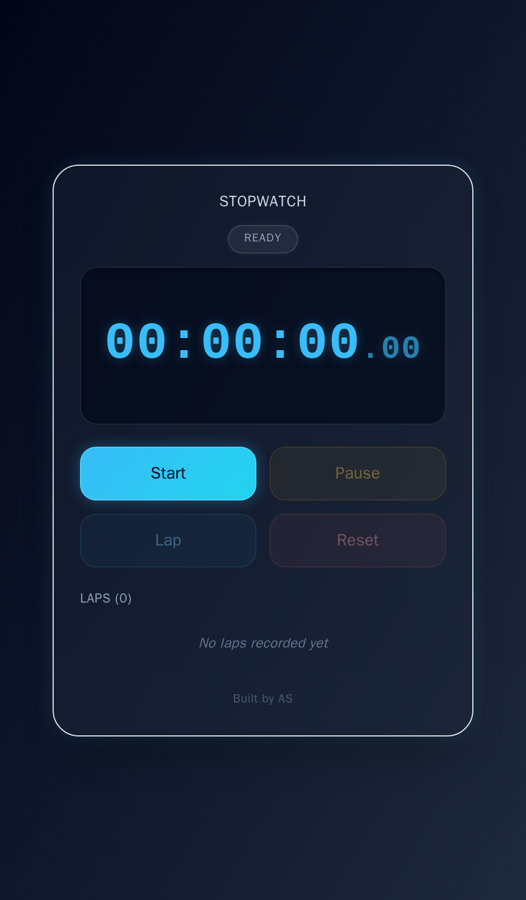
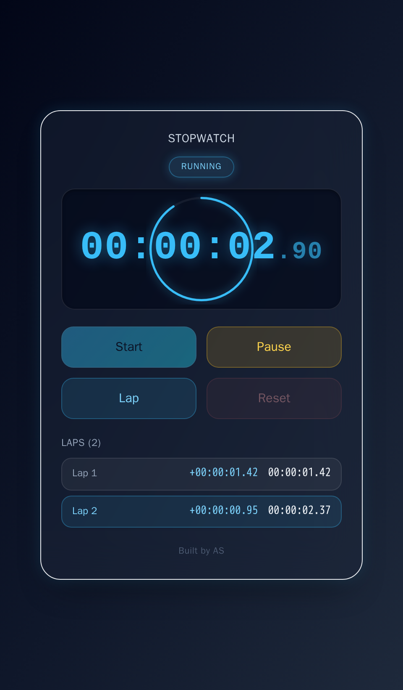
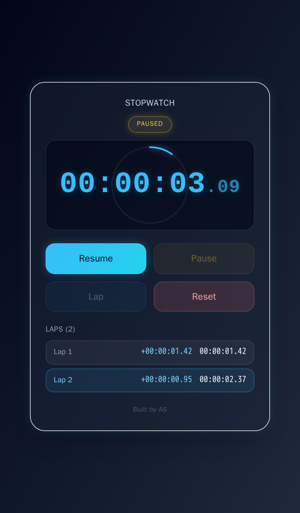

# ⏱️ Stopwatch

A precise, dark glassmorphism stopwatch built with **HTML5**, **Tailwind CSS**, and **vanilla JavaScript** — no frameworks, no build step, no dependencies to install.

It tracks elapsed time down to the centisecond, with full Start / Pause / Resume / Reset control and a running lap list that shows both the split and cumulative time for every lap.

---

## 📸 Screenshot / Preview

<table align="center">
  <tr>
    <td align="center">
       
      <b>Ready</b>
    </td>
    <td align="center">
       
      <b>Running — Progress Ring & Laps</b>
    </td>
    <td align="center">
       
      <b>Paused</b>
    </td>
  </tr>
</table>

---

## ✨ Key Features

- 🎨 **Dark glassmorphism design** — frosted-glass card, soft borders, and a subtle ambient glow over a dark gradient background, matching the rest of the portfolio's visual language.
- ⏱️ **Precise digital readout** — `HH:MM:SS.CS` display accurate to the centisecond, driven by `requestAnimationFrame` against a real timestamp rather than a naive one-second interval, so it never drifts. Milliseconds render smaller and lighter than the main digits for readability.
- 🔵 **Circular progress ring** — a subtle ring sweeps around the readout once per second while running, freezes in place when paused, and hides at rest.
- 🚦 **Status indicator** — a small Ready / Running / Paused pill below the title with a soft per-state glow.
- ▶️ **Start / Pause / Resume / Reset controls** — buttons enable and disable based on the current state (e.g. Reset is only available once the watch is stopped), and Start relabels itself to Resume after a pause.
- 🏁 **Lap timing** — record laps while running; a live "Laps (N)" counter tracks the count, each entry shows its split and cumulative time, and the newest lap stays highlighted.
- ⌨️ **Keyboard shortcuts** — `Space` to start/pause, `L` to lap, `R` to reset.
- 🎬 **Smooth UI** — buttons that lift and glow on hover, new lap rows animate in, and the seconds digit gets a brief tick animation each time it changes.
- 📱 **Responsive design** — scales cleanly across desktop, tablet, and mobile screens.

---

## 🛠️ Tech Stack

| Layer      | Technology                        |
|------------|------------------------------------|
| Structure  | HTML5                              |
| Styling    | Tailwind CSS (via CDN)             |
| Behavior   | JavaScript (ES6+, vanilla)         |

---

## 🚀 How to Run

No installation, build tools, or dependencies are required.

1. Clone or download this repository.
2. Open `index.html` directly in any modern browser (Chrome, Firefox, Edge, Safari).

That's it — the stopwatch runs entirely client-side.

---

## 🔮 Future Enhancements

- 📤 Export lap times (CSV)
- 🔊 Sound cue on lap / reset
- 🌗 Light/dark theme switcher
- 📴 Offline support via PWA

---

## 🙌 Credits

Built by **AS**.
